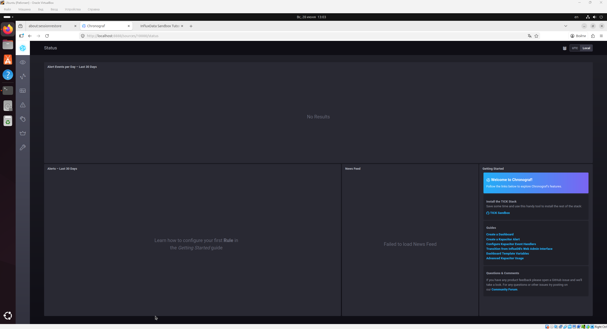
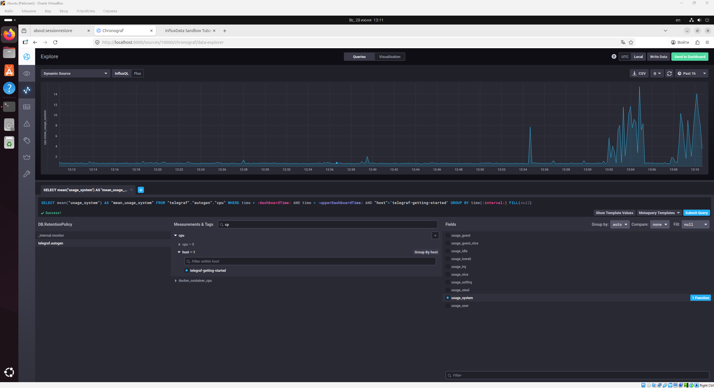
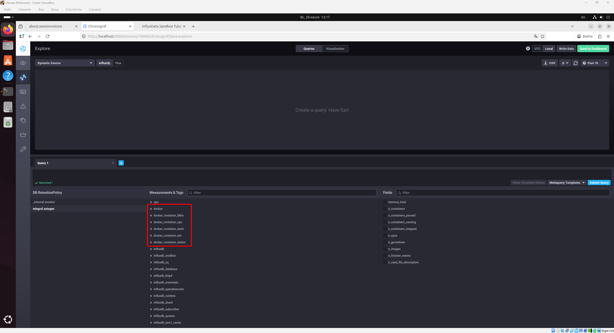

# Домашнее задание к занятию "`Системы мониторинга`" - `Сунцов Андрей`


---

## Задание 1

`Вас пригласили настроить мониторинг на проект. На онбординге вам рассказали, что проект представляет из себя платформу для вычислений с выдачей текстовых отчетов, которые сохраняются на диск. Взаимодействие с платформой осуществляется по протоколу http. Также вам отметили, что вычисления загружают ЦПУ. Какой минимальный набор метрик вы выведите в мониторинг и почему?`

Так как проект принимает HTTP-запросы, выполняет вычисления, формирует текстовые отчёты и сохраняет их на диск, мониторинг должен покрывать весь путь выполнения пользовательского запроса:


### 1. HTTP-метрики

| Метрика | Зачем нужна |
|---|---|
| Количество HTTP-запросов | Позволяет видеть входящую нагрузку на сервис |
| HTTP-коды ответов: `2xx`, `3xx`, `4xx`, `5xx` | Позволяют понимать, сколько запросов успешны, сколько завершились ошибками или редиректами |
| Время ответа HTTP-запросов | Показывает, насколько быстро сервис отвечает пользователю |
| `p95` / `p99 latency` | Показывает, как сервис работает не только в среднем, но и для самых медленных запросов |

---

### 2. CPU-метрики

| Метрика | Зачем нужна |
|---|---|
| `CPU usage` | Вычисления нагружают процессор, поэтому важно видеть его утилизацию |
| `Load average` | Показывает, есть ли очередь процессов, ожидающих выполнения на CPU |
| `CPU iowait` | Помогает понять, не ждёт ли процессор завершения операций диска |

---

### 3. RAM-метрики

| Метрика | Зачем нужна |
|---|---|
| Использование RAM | При нехватке оперативной памяти приложение может начать работать медленнее или завершиться с ошибкой |
| Использование swap | Если активно используется swap, это часто говорит о нехватке оперативной памяти |
| OOM events | Позволяют увидеть ситуации, когда процессы были завершены системой из-за нехватки памяти |

---

### 4. Дисковые метрики

| Метрика | Зачем нужна |
|---|---|
| Свободное место на диске | Отчёты сохраняются на диск, поэтому свободное место может закончиться |
| Использование inodes | При большом количестве маленьких отчётов могут закончиться inodes, даже если свободное место на диске ещё есть |
| Disk I/O | Показывает нагрузку на диск при записи отчётов |
| Disk latency | Помогает увидеть задержки при чтении и записи данных |

---

### 5. Метрики приложения

| Метрика | Зачем нужна |
|---|---|
| Количество успешно созданных отчётов | Показывает выполнение основной бизнес-функции платформы |
| Количество ошибок при генерации отчётов | Позволяет видеть проблемы именно в логике приложения |
| Время генерации отчёта | Показывает, насколько быстро пользователь получает результат |
| Ошибки записи отчёта на диск | Важно отслеживать, так как результат работы сохраняется в файловую систему |

---

## Задание 2

`Менеджер продукта посмотрев на ваши метрики сказал, что ему непонятно что такое RAM/inodes/CPUla. Также он сказал, что хочет понимать, насколько мы выполняем свои обязанности перед клиентами и какое качество обслуживания. Что вы можете ему предложить?`

Менеджеру продукта можно предложить отдельный dashboard с метриками уровня SLI, SLO и SLA.

---

SLI (Service Level Indicator) - Измеримый показатель качества сервиса
SLO (Service Level Objective) - Внутренняя цель команды по качеству сервиса
SLA (Service Level Agreement) - Обязательство перед клиентом по качеству сервиса

---

### Примеры SLI

| SLI | Что показывает |
|---|---|
| Доля успешных HTTP-запросов | Сколько запросов пользователей завершилось успешно |
| Error rate | Какой процент запросов завершился ошибкой |
| p95 latency | За какое время сервис отвечает на 95% запросов |
| Доля успешно созданных отчётов | Сколько отчётов было успешно сформировано |
| Время генерации отчёта | Как быстро пользователь получает результат |
| Доступность сервиса | Какой процент времени сервис был доступен |

---

### Примеры SLO

| SLO | Значение |
|---|---|
| Доступность сервиса | Не ниже 99% в месяц |
| Успешные HTTP-запросы | Не менее 99% запросов должны завершаться успешно |
| Время ответа сервиса | 95% запросов должны выполняться быстрее 1 секунды |
| Генерация отчётов | 95% отчётов должны формироваться быстрее 10 секунд |
| Ошибки генерации отчётов | Доля ошибок должна быть меньше 1% |

---

### Пример SLA

| SLA | Обязательство |
|---|---|
| Доступность сервиса | Сервис доступен не менее 99% времени в месяц |
| Время реакции на инцидент | Критичный инцидент обрабатывается в течение 15 минут |
| Качество выполнения запросов | Не менее 99% пользовательских запросов завершаются успешно |

---

## Задание 3

`Вашей DevOps команде в этом году не выделили финансирование на построение системы сбора логов. Разработчики в свою очередь хотят видеть все ошибки, которые выдают их приложения. Какое решение вы можете предпринять в этой ситуации, чтобы разработчики получали ошибки приложения?`

Передавать информацию об ошибках приложения через уже существующие инструменты мониторинга и уведомлений

---

## Задание 4

`Вы, как опытный SRE, сделали мониторинг, куда вывели отображения выполнения SLA=99% по http кодам ответов. Вычисляете этот параметр по следующей формуле: summ_2xx_requests/summ_all_requests. Данный параметр не поднимается выше 70%, но при этом в вашей системе нет кодов ответа 5xx и 4xx. Где у вас ошибка?`

Ошибка заключается в том, что SLA считается только по HTTP-кодам `2xx`, но в общее количество запросов попадают также коды `3xx`.

Если в системе нет `4xx` и `5xx`, а показатель не поднимается выше 70%, значит значительная часть запросов завершается кодами `3xx`.

Для исправления нужно либо считать успешными не только `2xx`, но и допустимые `3xx`, либо пересмотреть набор endpoint'ов, которые участвуют в расчёте SLA.

## Задание 5

`Опишите основные плюсы и минусы pull и push систем мониторинга.`

### Плюсы pull-модели

| Плюс | Описание |
|---|---|
| Централизованный контроль | Сервер мониторинга сам управляет тем, какие targets опрашивать и как часто |
| Легко понять, что сервис недоступен | Если target перестал отвечать, мониторинг сразу видит проблему |
| Удобно использовать service discovery | Можно автоматически находить новые сервисы, например в Kubernetes |
| Проще контролировать нагрузку | Частота сбора метрик задаётся централизованно на стороне мониторинга |
| Хорошо подходит для динамической инфраструктуры | Удобно использовать в Kubernetes, Docker Swarm и других окружениях, где сервисы часто появляются и исчезают |

---

### Минусы pull-модели

| Минус | Описание |
|---|---|
| Нужна сетевая доступность targets | Сервер мониторинга должен иметь возможность подключиться к приложению или exporter'у |
| Сложнее работать через NAT и firewall | Если сервис находится в закрытой сети, мониторинг может не иметь к нему доступа |
| Не всегда удобно для batch jobs | Короткоживущая задача может завершиться раньше, чем мониторинг успеет её опросить |
| Нужно открывать endpoint с метриками | Обычно приложение или exporter должны отдавать метрики по HTTP, например на `/metrics` |
| Требуется правильная настройка discovery | Если monitoring server не знает о target, он не сможет собрать с него метрики |

---

### Плюсы push-модели

| Плюс | Описание |
|---|---|
| Удобно работать через NAT и firewall | Агент сам отправляет данные наружу, поэтому не нужно открывать входящий доступ к приложению |
| Хорошо подходит для batch jobs | Короткоживущая задача может отправить метрики перед завершением |
| Не нужно открывать endpoint на приложении | Приложение или агент сами отправляют данные в систему мониторинга |
| Удобно для edge/IoT-сценариев | Устройства или удалённые агенты могут сами отправлять метрики в центральную систему |
| Можно отправлять данные сразу после события | Метрика может быть отправлена сразу после выполнения операции |

---

### Минусы push-модели

| Минус | Описание |
|---|---|
| Сложнее понять, что агент или сервис умер | Если метрики перестали приходить, нужно отдельно определять, это ошибка сервиса или просто нет новых данных |
| Риск перегрузки системы мониторинга | Большое количество агентов может одновременно отправлять данные |
| Сложнее централизованно управлять частотой отправки | Каждый агент может иметь свою настройку интервала отправки |
| Возможна потеря данных | Если сеть недоступна и у агента нет буфера, метрики могут потеряться |
| Сложнее контролировать список источников | Система мониторинга может получать данные от разных агентов, и нужно отдельно следить за их актуальностью |

---

## Задание 6

```
Какие из ниже перечисленных систем относятся к push модели, а какие к pull? А может есть гибридные?

Prometheus
TICK
Zabbix
VictoriaMetrics
Nagios
```

Prometheus относится к `pull`-модели.

TICK относится к `push`-модели.

Zabbix, VictoriaMetrics и Nagios являются гибридными системами, потому что поддерживают оба подхода.

---

## Задание 7

`Склонируйте себе репозиторий и запустите TICK-стэк, используя технологии docker и docker-compose.
В виде решения на это упражнение приведите скриншот веб-интерфейса ПО chronograf (http://localhost:8888).`



---

## Задание 8

```
Перейдите в веб-интерфейс Chronograf (http://localhost:8888) и откройте вкладку Data explorer.

Нажмите на кнопку Add a query
Изучите вывод интерфейса и выберите БД telegraf.autogen
В measurments выберите cpu->host->telegraf-getting-started, а в fields выберите usage_system. Внизу появится график утилизации cpu.
Вверху вы можете увидеть запрос, аналогичный SQL-синтаксису. Поэкспериментируйте с запросом, попробуйте изменить группировку и интервал наблюдений.
Для выполнения задания приведите скриншот с отображением метрик утилизации cpu из веб-интерфейса.
```



---

## Задание 9

```
Изучите список telegraf inputs. Добавьте в конфигурацию telegraf следующий плагин - docker:
[[inputs.docker]]
  endpoint = "unix:///var/run/docker.sock"
Дополнительно вам может потребоваться донастройка контейнера telegraf в docker-compose.yml дополнительного volume и режима privileged:

  telegraf:
    image: telegraf:1.4.0
    privileged: true
    volumes:
      - ./etc/telegraf.conf:/etc/telegraf/telegraf.conf:Z
      - /var/run/docker.sock:/var/run/docker.sock:Z
    links:
      - influxdb
    ports:
      - "8092:8092/udp"
      - "8094:8094"
      - "8125:8125/udp"
После настройке перезапустите telegraf, обновите веб интерфейс и приведите скриншотом список measurments в веб-интерфейсе базы telegraf.autogen . Там должны появиться метрики, связанные с docker.
```



---


